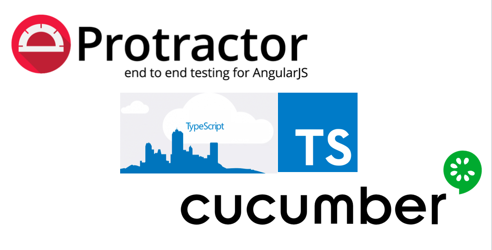

<p align="center">

</p>

<p align="center">
   <i><strong>This project demonstrates the basic protractor-cucumber-typescript framework project setup.
</strong></i>
<p>

<p align="center">
<a href="https://circleci.com/gh/igniteram/protractor-cucumber-typescript/tree/master"></a>
<a href="https://david-dm.org/igniteram/protractor-cucumber-typescript"></a>
<a href=#contributors></a>
<a href="https://opensource.org/licenses/MIT"></a>
</p>

---


### Protractor-Cucumber-TypeScript Setup Guide   

### Medium Article
Please do checkout my medium article which would give you more insight on this setup. [protractor-cucumber-typescript(Medium)](https://medium.com/@igniteram/e2e-testing-with-protractor-cucumber-using-typescript-564575814e4a)

### Features
* No typings.json or typings folder, they have been replaced by better **'@types'** modules in package.json.
* ts-node(typescript execution environment for node) in cucumberOpts. 
* All scripts written with > Typescript2.0 & Cucumber2.0.
* Neat folder structures with transpiled js files in separate output folder.
* Page Object design pattern implementation.
* Extensive hooks implemented for BeforeFeature, AfterScenarios etc.
* Screenshots on failure feature scenarios.


### To Get Started

#### Pre-requisites
1.NodeJS installed globally in the system.
https://nodejs.org/en/download/

2.Chrome or Firefox browsers installed.

3.Text Editor(Optional) installed-->Sublime/Visual Studio Code/Brackets.

#### Setup Scripts
* Clone the repository into a folder
* Go inside the folder and run following command from terminal/command prompt
```
npm install 
```
* All the dependencies from package.json and ambient typings would be installed in node_modules folder.

#### Run Scripts

* First step is to fire up the selenium server which could be done in many ways,  **webdriver-manager** proves very handy for this.The below command should download the **chrome & gecko driver** binaries locally for you!

```
npm run webdriver-update
``` 

* Then you should start your selenium server!
```
npm run webdriver-start
```

* The below command would create an output folder named 'typeScript' and transpile the .ts files to .js.
```
npm run build
```

* Now just run the test command which launches the Chrome Browser and runs the scripts.
```
npm test
```


#### Writing Features
```
Feature: To search typescript in google
@TypeScriptScenario

  Scenario: Typescript Google Search
    Given I am on google page
    When I type "Typescript"
    Then I click on search button
    Then I clear the search text
```
#### Writing Step Definitions
    
```
import { browser } from "protractor";
import { SearchPageObject } from "../pages/searchPage";
const { Given } = require("cucumber");
const chai = require("chai").use(require("chai-as-promised"));
const expect = chai.expect;

const search: SearchPageObject = new SearchPageObject();

Given(/^I am on google page$/, async () => {
    await expect(browser.getTitle()).to.eventually.equal("Google");
});
```

#### Writing Page Objects
```
import { $ } from "protractor";

export class SearchPageObject {
    public searchTextBox: any;
    public searchButton: any;

    constructor() {
        this.searchTextBox = $("#lst-ib");
        this.searchButton = $("input[value='Google Search']");
    }
}
```
#### Cucumber Hooks
Following method takes screenshot on failure of each scenario
```
After(async function(scenario) {
    if (scenario.result.status === Status.FAILED) {
        // screenShot is a base-64 encoded PNG
         const screenShot = await browser.takeScreenshot();
         this.attach(screenShot, "image/png");
    }
});
```
#### CucumberOpts Tags
Following configuration shows to call specific tags from feature files
```
cucumberOpts: {
    compiler: "ts:ts-node/register",
    format: "json:./reports/json/cucumber_report.json",
    require: ["../../stepdefinitions/*.ts", "../../support/*.ts"],
    strict: true,
    tags: "@TypeScriptScenario or @CucumberScenario or @ProtractorScenario",
},
```
#### HTML Reports
Currently this project has been integrated with [cucumber-html-reporter](https://github.com/gkushang/cucumber-html-reporter), which is generated in the `reports` folder when you run `npm test`.
They can be customized according to user's specific needs.


## Contributions
For contributors who want to improve this repo by contributing some code, reporting bugs, issues or improving documentation - PR's are highly welcome, please maintain the coding style , folder structure , detailed description of documentation and bugs/issues with examples if possible.

## Contributors

<!-- ALL-CONTRIBUTORS-LIST:START - Do not remove or modify this section -->
<!-- prettier-ignore -->
| [<br /><sub><b>Ram Pasala</b></sub>](https://in.linkedin.com/in/rpasala)<br />[💻](https://github.com/igniteram/protractor-cucumber-typescript/commits?author=igniteram "Code") [📖](https://github.com/igniteram/protractor-cucumber-typescript/commits?author=igniteram "Documentation") [⚠️](https://github.com/igniteram/protractor-cucumber-typescript/commits?author=igniteram "Tests") [🐛](https://github.com/igniteram/protractor-cucumber-typescript/issues?q=author%3Aigniteram "Bug reports") | [<br /><sub><b>Burk Hufnagel</b></sub>](https://github.com/BurkHufnagel)<br />[💻](https://github.com/igniteram/protractor-cucumber-typescript/commits?author=BurkHufnagel "Code") | [<br /><sub><b>Alejandro</b></sub>](https://github.com/sanko1983)<br />[💻](https://github.com/igniteram/protractor-cucumber-typescript/commits?author=sanko1983 "Code") [🐛](https://github.com/igniteram/protractor-cucumber-typescript/issues?q=author%3Asanko1983 "Bug reports") | [<br /><sub><b>David Jimenez</b></sub>](https://github.com/runnerdave)<br />[💻](https://github.com/igniteram/protractor-cucumber-typescript/commits?author=runnerdave "Code") |
| :---: | :---: | :---: | :---: |
<!-- ALL-CONTRIBUTORS-LIST:END -->
<!-- ALL-CONTRIBUTORS-LIST:START - Do not remove or modify this section -->
<!-- prettier-ignore -->
<!-- ALL-CONTRIBUTORS-LIST:END -->
Thanks goes to these wonderful people ([emoji key](https://github.com/kentcdodds/all-contributors#emoji-key)):

<!-- ALL-CONTRIBUTORS-LIST:START - Do not remove or modify this section -->
<!-- prettier-ignore -->
<!-- ALL-CONTRIBUTORS-LIST:END -->

This project follows the [all-contributors](https://github.com/kentcdodds/all-contributors) specification. Contributions of any kind welcome!

## License
```   
MIT License

Copyright (c) 2018 Ram Pasala
```